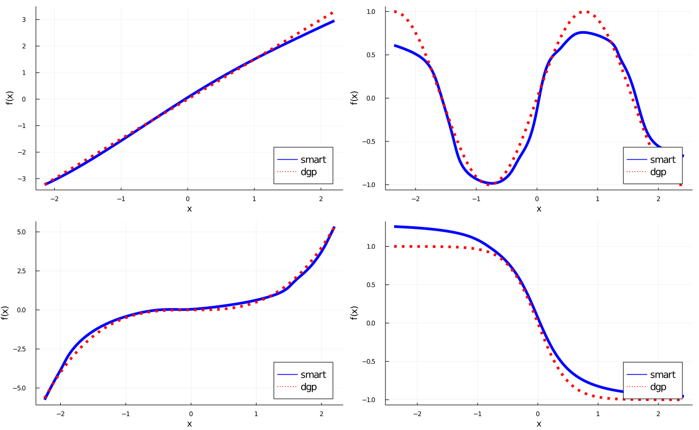
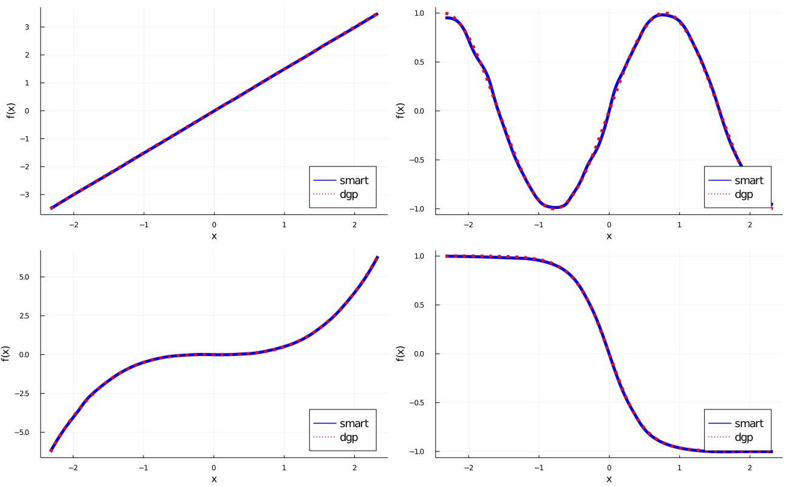

# SMARTboost

[](https://github.com/PaoloGiordani/SMARTboost.jl/actions)

A Julia implementation of SMARTboost (Smooth Additive Regression Trees), as described in the paper [SMARTboost: Efficient Boosting of Smooth Additive Regression Trees](https://SSRN/....).

Currently support only L2 loss, but extensions will be provided soon.

Input features can be a be `Array{Float64/Float32}` or DataFrame (which is internally converted to a matrix of floats.)

## Installation

Latest:

```julia-repl
julia> Pkg.add("https://github.com/PaoloGiordani/SMARTboost.jl")
```

## Parameters (incomplete list, see SMARTparam Documentation for more).

- `loss`              [:L2] currently only :L2 is supported, but extensions coming soon.
- `depth`             [4] tree depth. If not default, then typically cross-validated in SMARTfit.
- `lambda`            [0.2] learning rate
- `loglikdivide`      [1.0] with panel data, SMARTloglikdivide() can be used to set this parameter
- `overlap`           [0] number of overlaps. Typically overlap = h-1, where y(t) = Y(t+h)-Y(t)
- `nfold`             [5] n in n-fold cv. Set nfold = 1 for a single validation set, the last sharevalidation share of the sample.
- `verbose`           [:Off] verbosity :On or :Off
- `T`                 [Float32] Float32 is faster than Float64
- `randomizecv`       [false] default is purged-cv (see paper); a time series or panel structure is automatically detected (see SMARTdata)
- `subsamplesharevs`  [1.0] row subs-sampling; if <1.0, only a randomly drawn (at each iteration) share of the sample is used in determining ι (which feature),μ,τ.
- `subsampleshare_columns`  [1.0] column sub-sampling

## Example1 with n = 1_000


## Example1 with n = 1_000_000


## Example1

```julia

using SMARTboost   # single core

#=
number_workers  = 4  # desired number of workers
using Distributed
nprocs()<number_workers ? addprocs( number_workers - nprocs()  ) : addprocs(0)
@everywhere using SMARTboost
=#

using Random, Plots, JLD2

# Some options for SMARTboost
cvdepth   = false    # false to use the default depth (3), true to cv
nfold     = 1        # nfold cv. 1 faster, default 5 is slower, but more accurate.

# options to generate data. y = sum of four additive nonlinear functions + Gaussian noise(0,stde^2)
n,p,n_test  = 10_000,5,100_000
stde        = 1.0

f_1(x,b)    = b*x
f_2(x,b)    = sin.(b*x)
f_3(x,b)    = b*x.^3
f_4(x,b)    = b./(1.0 .+ (exp.(4.0*x))) .- 0.5*b

b1,b2,b3,b4 = 1.5,2.0,0.5,2.0

# generate data
x,x_test = randn(n,p), randn(n_test,p)
f        = f_1(x[:,1],b1) + f_2(x[:,2],b2) + f_3(x[:,3],b3) + f_4(x[:,4],b4)
f_test   = f_1(x_test[:,1],b1) + f_2(x_test[:,2],b2) + f_3(x_test[:,3],b3) + f_4(x_test[:,4],b4)
y        = f + randn(n)*stde

# set up SMARTparam and SMARTdata, then fit and predit
param  = SMARTparam( nfold = nfold,verbose = :Off )
data   = SMARTdata(y,x,param,fdgp=f)

if cvdepth==false
    output = SMARTfit(data,param)                # default depth
else
    output = SMARTfit(data,param,paramfield=:depth,cv_grid=[1,2,3,4,5],stopwhenlossup=true)  # starts at depth = 1, stops as soon as loss increases
end

yf     = SMARTpredict(x_test,output.SMARTtrees)  # predict

println("\n depth = $(output.bestvalue), number of trees = $(output.ntrees) ")
println(" out-of-sample RMSE from truth ", sqrt(sum((yf - f_test).^2)/n_test) )

# save (load) fitted model
@save "output.jld2" output
#@load "output.jld2" output    # Note: key must be the same, e.g. @load "output.jld2" output2 is a KeyError

# feature importance, partial dependence plots and marginal effects
fnames,fi,fnames_sorted,fi_sorted,sortedindx = SMARTrelevance(output.SMARTtrees,data)
q,pdp  = SMARTpartialplot(data,output.SMARTtrees,[1,2,3,4])
qm,me  = SMARTmarginaleffect(data,output.SMARTtrees,[1,2,3,4],npoints = 40)

# plot partial dependence


```

## Example2 (Global Equity data, parallelization via Distributed, CV and priors for panel data)

Refer to examples/Example2. Notice how we prepare the panel data for purged-CV, and calibrate loglikdivide; here the effective sample size ess is much smaller than n.

```julia

# Setting up parallelization
number_workers  = 4  # desired number of workers
using Distributed
nprocs()<number_workers ? addprocs( number_workers - nprocs()  ) : addprocs(0)
@everywhere using SMARTboost

# ....
# prepare data; sorting dataframe by :date is required by purged-CV.
sort!(df,:date)

# calibrate loglikdivide.
lld,ess =  SMARTloglikdivide(df,:excessret,:date,overlap=0)
param   = SMARTparam(loglikdivide = lld,overlap=0,stopwhenlossup=true) # in CV, stop as soon as loss increases


```

Refer to examples/Example2. Here we point out how to do a train-validation-test split in SMARTboost.
In particular, notice that the default is to re-fit the model (with the cross-validated tuning parameters) on the entire data (train+validation), as is done in n-fold CV, even if nfold = 1. If you wish to skip this step (for speed or for comparison with other methods), set nofullsample = true in SMARTfit.
When nfold = 1, the default is to use the last 30% of the data as validation test ('approximately' 30% in some cases because of purged validation). To change this default, set e.g. sharevalidation = 0.2 for the last 20% of the sample, or sharevalidation = 1000 for the last 1000 observations. Setting sharevalidation to an integer switches the default to nfold = 1.

# Some suggestions for speeding up SMARTboost.

Example of approximate computing time for 100 trees, depth = 4, using 8 workers on an AMD EPYC 7542, dgp  linear. (dgp is linear. 100 trees are sufficient in most applications.)

| n x p             |  Minutes for 100 trees |
|-------------------|:----------------------:|
| 100k x 10         |      1.7'              |
| 1m x 10           |       17'              |
| 10m x 10          |      170'              |
|                   |                        |
| 100k x 100        |       9'               |
| 1m x 100          |      85'               |
| 10m x 100         |     850'               |


SMARTboost runs much faster (particularly with large n) with 4-8 cores than with one, after the initial one-off cost.
If you are running on few cores, consider limiting depth <= 3.

With large n:
- Use a single validation sample instead of the default 5-fold cv (param.nfold=1). Additionally, in SMARTfit, set nofullsample = true further reduces computing time by roughly 60% (at the cost of a modest efficiency loss.) nofullsample = true is also required if you want to have a train-validation-test split, so that the model is only fit on the train set (the default will use a validation test to CV, and then re-train on the train+validation at the optimum parameter values).
- Computing time increases rapidly with param.depth in smooth trees. If you cv tree depth, start at a low value and stop as soon as there is
  no sizable improvement (set stopwhenlossup = true in SMARTfit). With 8 workers, as a rule of thumb, computing times double if depth <- depth + 1.
- set stderulestop = 0.05 or 0.1 to stop iterations when the loss is no longer decreasing sizably (at a cost of a small loss in performance.)
- row and column subs-sampling are supported.
